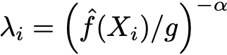

# Adaptive Width KDE with Gaussian Kernels

The unweighted kernel density estimator is defined as

where the product `h * lambda` takes the role of a local `sigma`.

The kernel bandwith is choosen locally to account for variations in the
density of the data.
Areas with large density gets smaller kernels and vice versa.
This smoothes the tails and gets high resolution in high statistics regions.
The local bandwidth paramter is defined as

where

is some normalization and `^f(X_i)` the KDE estimate at the data point `X_i`.
The local bandwidth is multiplied to the global bandwidth for each kernel.

Furthermore different scales in data is accounted for by scaling it via its
covariance matrix to an equal spread.
First a global kernel bandwidth is applied to the transformed data and then
based on that density a local bandwidth parameter is applied.

All credit for the method goes to [1] and to S. Schoenen and L. Raedel for
huge parts of the implementation.
For information on Silverman or Scott rule, see [2] or [3].

## References
- [1] B. Wang and X. Wang, "Bandwidth Selection for Weighted Kernel Density Estimation", Sep. 2007, DOI: 10.1214/154957804100000000.
- [2] D.W. Scott, "Multivariate Density Estimation: Theory, Practice, and Visualization", John Wiley & Sons, New York, Chicester, 1992.
- [3] B.W. Silverman, "Density Estimation for Statistics and Data Analysis", Vol. 26, Monographs on Statistics and Applied Probability, Chapman and Hall, London, 1986.